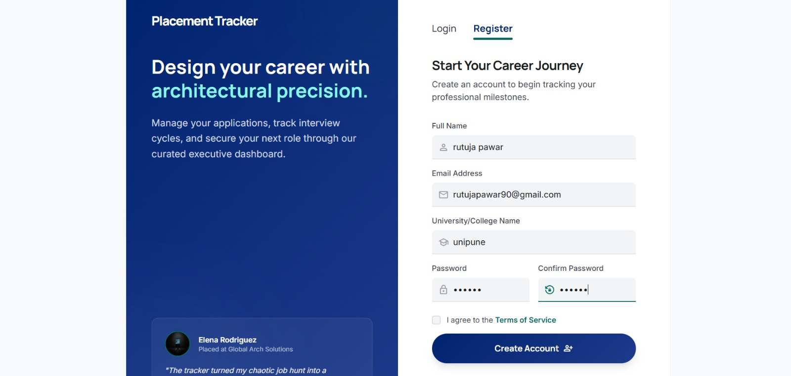
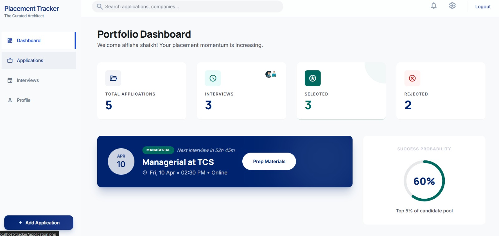
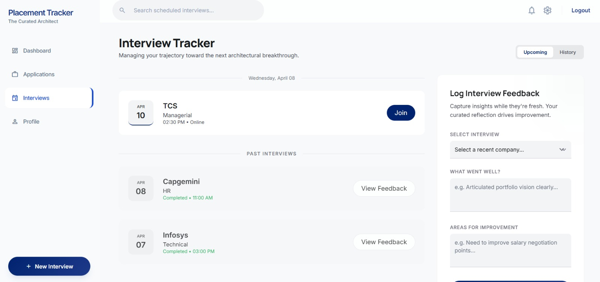

# Placement-Tracker

A web-based **Placement Tracker** developed as a Final Year Project using **PHP** and **PostgreSQL**. The application helps students efficiently manage their placement process by tracking job applications, interview schedules, and application statuses through a simple and user-friendly interface.

---

## ✨ Features

- 🔐 User Registration & Login
- 👤 Profile Management
- ➕ Add Job Applications
- ✏️ Update Application Details
- ❌ Delete Applications
- 📅 Manage Interview Schedules
- 📊 Dashboard to Track Placement Progress
- 🔒 Secure Session Management
- 💻 Responsive User Interface

---

## 🛠️ Tech Stack

### Frontend
- HTML5
- CSS3
- JavaScript
- Bootstrap

### Backend
- PHP

### Database
- PostgreSQL

### Development Tools
- XAMPP
- pgAdmin 4
- Visual Studio Code

---

## 📂 Project Structure

```text
Placement-Tracker/
│
├── README.md
├── connect.php
├── login.php
├── login_process.php
├── logout.php
├── register.php
├── register_process.php
├── dashboard.php
├── profile.php
├── application.php
├── add-application.php
├── update_application.php
├── delete_application.php
├── interview.php
├── add-interview.php
├── placement_tracker.sql
├── css/
├── js/
├── images/
└── screenshots/
```

---

## ⚙️ Installation

1. Clone the repository

```bash
git clone https://github.com/alfisha-shaikh/Placement-Tracker.git
```

2. Move the project to the **htdocs** folder in XAMPP.

3. Start **Apache** from the XAMPP Control Panel.

4. Create a PostgreSQL database named **placement_tracker**.

5. Import the **placement_tracker.sql** file using **pgAdmin 4**.

6. Update your PostgreSQL database credentials in **connect.php**.

7. Open your browser and visit:

```
http://localhost/Placement-Tracker/
```

---

## 📸 Screenshots

### Login Page


### Registration Page



### Dashboard



### Job Applications


### Interview Management



### Profile Page


---

## 🚀 Future Enhancements

- Resume Upload
- Email Notifications
- Interview Reminders
- Company-wise Analytics
- Search & Filter
- Export Reports (PDF/Excel)
- Admin Dashboard
- Dark Mode
- Mobile-Friendly Enhancements

---

## 👨‍💻 Author

**Alfisha Shaikh**

- GitHub: https://github.com/alfisha-shaikh
- LinkedIn: (https://www.linkedin.com/in/alfisha-shaikh-523388369/)

---

## 📄 License

This project is developed for educational and portfolio purposes as a Final Year Project.
